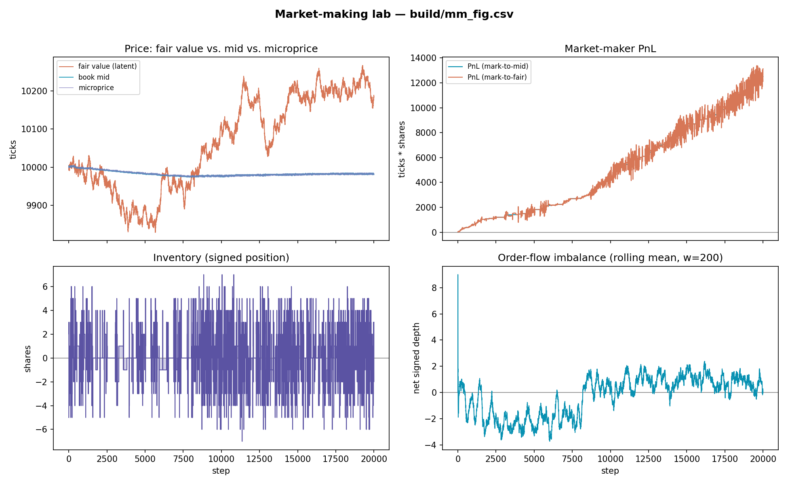

# Limit Order Book & Matching Engine

This is a single-threaded C++20 implementation of the two pieces at the
heart of every electronic exchange: a limit order book that holds resting 
orders in price-time priority and a matching engine that crosses incoming 
orders against it. Limit orders rest in the book, market orders sweep the 
best available levels, and trades execute at the resting order's price with
earlier orders at the same price filling first.

There are two modes: an interactive REPL where you trade against a seeded 
market simulator, and a benchmark that measures raw engine throughput —
**16 million orders per second on a single core, about 62 ns per order.**
Standard library only, no external dependencies.

## Market-Making & Microstructure Lab

Beyond matching orders, this project runs a **market maker inside its own book** and
measures whether the strategy survives *adverse selection*, the core risk of providing
liquidity. A latent "fair value" drifts exogenously; **informed** traders trade toward it
and pick off stale quotes, while **noise** traders do not. The market maker (inventory-skew,
or the **Avellaneda-Stoikov** optimal model) quotes off the observable book mid only. It
never sees fair value, which is exactly why it can be picked off.

```bash
# every strategy knob (gamma/sigma/kappa/skew-k/half-spread/max-inventory) is
# tunable from the CLI; --json prints a machine-readable summary. See --help.
./build/orderbook --mm-sim 20000 --seed 42 --policy as --informed-frac 30 --out mm.csv
```

Reported metrics:
- **Markout PnL**: a fill's PnL measured a few steps later against fair value; negative means adverse selection.
- **Effective vs. realized spread**: taker cost vs. maker capture net of impact; the gap between them *is* adverse selection.
- **Kyle's λ**: price impact per unit of signed order flow.
- **VPIN**: volume-bucketed order-flow toxicity.

The CSV has one row per step (fair, mid, microprice, inventory, PnL, and more); `scripts/plot_mm.py` turns it into the figure below.

### Sample result: the adverse-selection gradient

Turning up the fraction of **informed** flow is the whole experiment. Averaged over
12 seeds (inventory-skew maker, 20000 steps; ± is standard error across seeds):

| Informed flow | MM fills | Final PnL vs. fair (ticks·shares) | Adverse selection (ticks) | Max \|inventory\| |
|---|---|---|---|---|
| 0% (pure noise) | 872 ± 34 | **+4024 ± 175** | 0.2 ± 0.0 | 6 ± 0 |
| 15% | 934 ± 248 | -827 ± 3009 | 17.2 ± 4.1 | 44 ± 5 |
| 30% | 182 ± 33 | +518 ± 2762 | 49.3 ± 11.7 | 50 ± 2 |

The error bars *are* the result:
- **Adverse selection rises sharply and reliably** with informed flow (0.2 to 17 to 49 ticks), a robust, monotone gradient.
- **Under pure noise the maker cleanly captures the spread** (+4024 ± 175) while barely carrying inventory.
- **Under toxic flow, terminal PnL is dominated by inventory risk**: the standard error dwarfs the mean, so any single seeded run is an unreliable read. That uncertainty *is* the risk of quoting into informed flow.

Here is one run of the lab (`--seed 3 --informed-frac 10`): the maker profitably captures
spread against light toxic flow, its inventory mean-reverting via skew.



The top-left panel is the thesis in one picture: the latent **fair value wanders, the
observable book mid is much stickier, and the maker only ever sees the mid**. The gap
between the two lines is its information disadvantage.

Regenerate the table and figure (numbers are seed- and machine-specific):

```bash
python3 scripts/sweep.py --policy inventory --steps 20000 --seeds 12          # the table
./build/orderbook --mm-sim 20000 --seed 3 --policy inventory --informed-frac 10 --out mm.csv
python3 scripts/plot_mm.py mm.csv --out docs/mm_overview.png                   # the figure
```

### Why this is different from a "trading bot"
This is a **market-microstructure** study on a hand-built order book (passive quoting,
queue dynamics, adverse selection), not a directional alpha strategy. It deliberately
keeps strategy/PnL plumbing thin; the focus is what only a real order book can show.

## Interactive REPL

Running `./build/orderbook` drops you into a REPL against a simulated market
(seed 42, so this exact book is reproducible):

    ================ ORDER BOOK ================
            ASKS
       100.09 |     70  (2)
       100.08 |    109  (2)
       100.07 |    114  (2)
       100.05 |     42  (1)
       100.03 |     95  (2)
       100.02 |     13  (1)
    --------------------------------------------
     Best Ask: 100.02   Mid: 99.99   Spread: 0.06
     Best Bid: 99.96
    --------------------------------------------
        99.96 |     73  (1)
        99.95 |    163  (3)
        99.94 |     11  (1)
        99.93 |     61  (1)
        99.92 |     33  (1)
        99.91 |     48  (1)
        99.90 |    100  (2)
            BIDS
    ============================================

Each row is a price level: aggregate resting quantity and (order count).
Asks print worst-first so the best ask sits nearest the spread; your fills
are tagged `(you)` in the trade tape.

## Commands

    buy 50 @ 100.10   limit buy      step [N]    run N sim events
    sell 25 @ 100.50  limit sell     book [N]    top N levels/side
    buy 50            market buy     trades [N]  last N trades
    sell 25           market sell    help / quit
    cancel 12         cancel by id

## Performance

The matching engine sustains **16 million orders per second on a single
core — roughly 62 nanoseconds per order** — including matching, resting,
and all cancel-index bookkeeping:

    Orders processed:  1000000
    Execution time:    0.062 seconds
    Throughput:        16.05 million orders/sec
    Trades executed:   152723
    Resting orders:    845416

(Apple M-series, Release build, seed 42.) Order generation is pre-computed
so the timed loop measures the engine alone, and identical seeds give
identical trade/resting counts on every run.

## Design

Prices are int64 ticks (1 tick = $0.01). This fixed-point representation 
avoids floating-point rounding errors and enables exact price comparison 
and reliable order-book indexing.

The `OrderBook` is a pure data structure; the `MatchingEngine` is the
algorithm that runs against it:

- Bids: `std::map<Price, PriceLevel, std::greater<>>` — best bid is `begin()`
- Asks: `std::map<Price, PriceLevel, std::less<>>` — best ask is `begin()`
- Each `PriceLevel`: `std::list<Order>` in FIFO arrival order + cached total
- Cancel index: `unordered_map<OrderId, {side, price, list iterator}>` —
  `std::list` iterators stay valid under other insertions/erasures

| Operation | Complexity (L = price levels/side) |
|---|---|
| Add resting order | O(log L) |
| Best bid / best ask | O(1) |
| One fill during matching | O(1) amortized (+O(log L) when a level empties) |
| Cancel | O(1) average (+O(log L) when a level empties) |
| Depth snapshot, top N | O(N) |

Matching rules: trades execute at the resting (maker) order's price, so price
improvement goes to the incoming order; partially filled resting orders keep
their queue position; an unfilled market-order remainder is cancelled, never
rested. Invariant: after any submit completes the book is never crossed.

## Build & run

    brew install cmake                # once
    cmake -B build && cmake --build build
    ./build/orderbook_tests           # 30 tests
    ./build/orderbook                 # interactive REPL

    # benchmark (use an optimized build for numbers)
    cmake -B build-release -DCMAKE_BUILD_TYPE=Release
    cmake --build build-release
    ./build-release/orderbook --benchmark

## Simplifying assumptions

Single security; strictly sequential order arrival; no latency, fees, or
persistence; no self-trade prevention; no order modification; no hidden 
liquidity; the simulator is naive random flow around a drifting reference 
price, not a market model; only limit and market orders.
